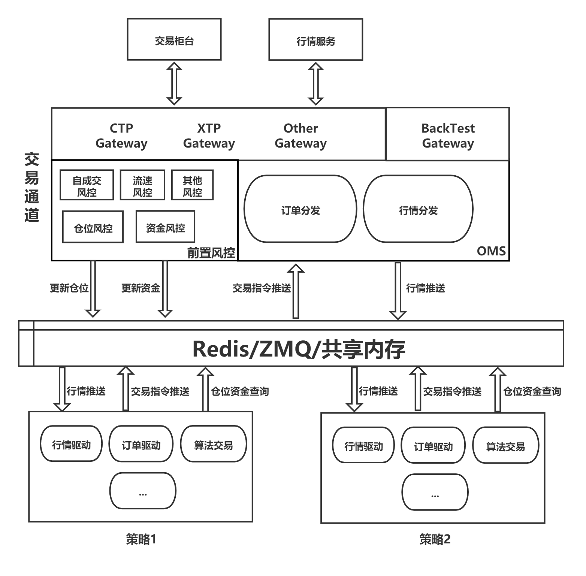
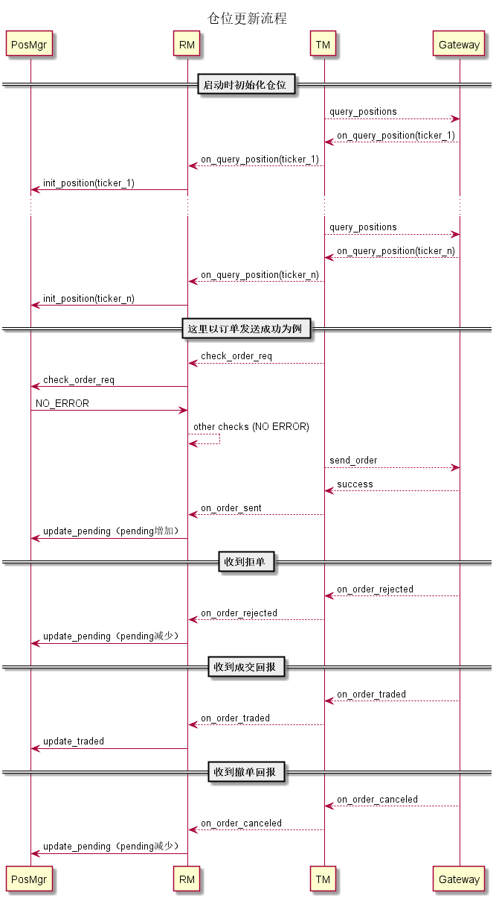
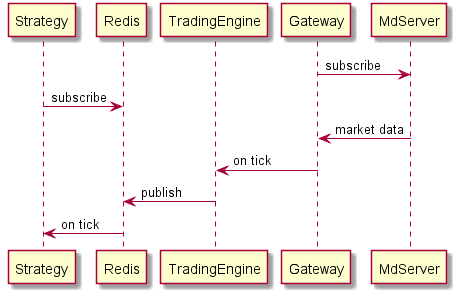

# Flare Trader 算法交易系统
| Platform | Build                                                                                                               |
| -------- | ------------------------------------------------------------------------------------------------------------------- |
| Linux    | [](https://travis-ci.com/DuckDuckDuck0/ft) |

Flare Trader是一套量化交易解决方案，旨在追求以下目标：
* 极低的交易时延，框架耗时控制在2us以内 (进行中)
* 提供从策略开发到部署落地的整个完整的解决方案
* 友好的策略开发接口及框架
* 模块化的设计，可以对各个组件进行定制化开发

目前Flare Trader离上面所列举的目标还差很远，但会持续地更新，大家有想法或是发现了bug，可以在issue上面自由讨论，也欢迎大家参与到ft的开发讨论中。

QQ交流群：341031341

目录
=================


* [FT 算法交易系统](#ft-%E7%AE%97%E6%B3%95%E4%BA%A4%E6%98%93%E7%B3%BB%E7%BB%9F)
* [目录](#%E7%9B%AE%E5%BD%95)
  * [1\. 平台说明](#1-%E5%B9%B3%E5%8F%B0%E8%AF%B4%E6%98%8E)
    * [1\.1\. 重大更新说明](#11-%E9%87%8D%E5%A4%A7%E6%9B%B4%E6%96%B0%E8%AF%B4%E6%98%8E)
    * [1\.2\. 支持的操作类型](#12-%E6%94%AF%E6%8C%81%E7%9A%84%E6%93%8D%E4%BD%9C%E7%B1%BB%E5%9E%8B)
    * [1\.3\. 编码规范](#13-%E7%BC%96%E7%A0%81%E8%A7%84%E8%8C%83)
  * [2\. 运行示例](#2-%E8%BF%90%E8%A1%8C%E7%A4%BA%E4%BE%8B)
  * [3\. 简介](#3-%E7%AE%80%E4%BB%8B)
    * [3\.1\. FT 是什么](#31-ft-%E6%98%AF%E4%BB%80%E4%B9%88)
    * [3\.2\. 基本架构](#32-%E5%9F%BA%E6%9C%AC%E6%9E%B6%E6%9E%84)
  * [4\. 交易引擎模块设计](#4-%E4%BA%A4%E6%98%93%E5%BC%95%E6%93%8E%E6%A8%A1%E5%9D%97%E8%AE%BE%E8%AE%A1)
    * [4\.1\. 模块之间的交互](#41-%E6%A8%A1%E5%9D%97%E4%B9%8B%E9%97%B4%E7%9A%84%E4%BA%A4%E4%BA%92)
    * [4\.2\. 交易管理模块](#42-%E4%BA%A4%E6%98%93%E7%AE%A1%E7%90%86%E6%A8%A1%E5%9D%97)
      * [4\.2\.1\. 接口设计](#421-%E6%8E%A5%E5%8F%A3%E8%AE%BE%E8%AE%A1)
      * [4\.2\.2\. 订单转发](#422-%E8%AE%A2%E5%8D%95%E8%BD%AC%E5%8F%91)
      * [4\.2\.3\. 仓位管理（RM模块的子规则）](#423-%E4%BB%93%E4%BD%8D%E7%AE%A1%E7%90%86rm%E6%A8%A1%E5%9D%97%E7%9A%84%E5%AD%90%E8%A7%84%E5%88%99)
      * [4\.2\.4\. 订单管理（RM模块的子规则）](#424-%E8%AE%A2%E5%8D%95%E7%AE%A1%E7%90%86rm%E6%A8%A1%E5%9D%97%E7%9A%84%E5%AD%90%E8%A7%84%E5%88%99)
      * [4\.2\.5\. 资金管理（RM模块的子规则）](#425-%E8%B5%84%E9%87%91%E7%AE%A1%E7%90%86rm%E6%A8%A1%E5%9D%97%E7%9A%84%E5%AD%90%E8%A7%84%E5%88%99)
    * [4\.3\. 风险管理模块](#43-%E9%A3%8E%E9%99%A9%E7%AE%A1%E7%90%86%E6%A8%A1%E5%9D%97)
    * [4\.4\. 交易网关模块](#44-%E4%BA%A4%E6%98%93%E7%BD%91%E5%85%B3%E6%A8%A1%E5%9D%97)
    * [4\.5\. 交易引擎初始化](#45-%E4%BA%A4%E6%98%93%E5%BC%95%E6%93%8E%E5%88%9D%E5%A7%8B%E5%8C%96)
  * [5\. 策略模型](#5-%E7%AD%96%E7%95%A5%E6%A8%A1%E5%9E%8B)
  * [6\. 目录结构](#6-%E7%9B%AE%E5%BD%95%E7%BB%93%E6%9E%84)
    * [6\.1\. include](#61-include)
        * [Core：核心数据类型](#core%E6%A0%B8%E5%BF%83%E6%95%B0%E6%8D%AE%E7%B1%BB%E5%9E%8B)
        * [IPC：进程间通讯，用于交易引擎与策略的通讯](#ipc%E8%BF%9B%E7%A8%8B%E9%97%B4%E9%80%9A%E8%AE%AF%E7%94%A8%E4%BA%8E%E4%BA%A4%E6%98%93%E5%BC%95%E6%93%8E%E4%B8%8E%E7%AD%96%E7%95%A5%E7%9A%84%E9%80%9A%E8%AE%AF)
        * [Utils：一些通用的功能](#utils%E4%B8%80%E4%BA%9B%E9%80%9A%E7%94%A8%E7%9A%84%E5%8A%9F%E8%83%BD)
    * [6\.2\. src](#62-src)
        * [gateway](#gateway)
        * [trading\_system](#trading_system)
        * [risk\_management](#risk_management)
        * [Strategy](#strategy)
        * [tools](#tools)
        * [test](#test)
  * [7\. 使用方式](#7-%E4%BD%BF%E7%94%A8%E6%96%B9%E5%BC%8F)
    * [7\.1\. 编译](#71-%E7%BC%96%E8%AF%91)
    * [7\.2\. 配置登录信息](#72-%E9%85%8D%E7%BD%AE%E7%99%BB%E5%BD%95%E4%BF%A1%E6%81%AF)
    * [7\.3\. 让示例跑起来](#73-%E8%AE%A9%E7%A4%BA%E4%BE%8B%E8%B7%91%E8%B5%B7%E6%9D%A5)
  * [8\. 开发你的第一个策略](#8-%E5%BC%80%E5%8F%91%E4%BD%A0%E7%9A%84%E7%AC%AC%E4%B8%80%E4%B8%AA%E7%AD%96%E7%95%A5)
  * [9\. 依赖](#9-%E4%BE%9D%E8%B5%96)
  * [附录1\. 风控管理模块组件](#%E9%99%84%E5%BD%951-%E9%A3%8E%E6%8E%A7%E7%AE%A1%E7%90%86%E6%A8%A1%E5%9D%97%E7%BB%84%E4%BB%B6)
    * [可平仓数量检测](#%E5%8F%AF%E5%B9%B3%E4%BB%93%E6%95%B0%E9%87%8F%E6%A3%80%E6%B5%8B)
    * [自成交检测](#%E8%87%AA%E6%88%90%E4%BA%A4%E6%A3%80%E6%B5%8B)
    * [Throttle Rate限制](#throttle-rate%E9%99%90%E5%88%B6)
  * [附录2\. 协议结构体说明](#%E9%99%84%E5%BD%952-%E5%8D%8F%E8%AE%AE%E7%BB%93%E6%9E%84%E4%BD%93%E8%AF%B4%E6%98%8E)
      * [1\. TradingEngine到Gateway的订单类型](#1-tradingengine%E5%88%B0gateway%E7%9A%84%E8%AE%A2%E5%8D%95%E7%B1%BB%E5%9E%8B)
      * [2\. redis到trading engine的下单指令](#2-redis%E5%88%B0trading-engine%E7%9A%84%E4%B8%8B%E5%8D%95%E6%8C%87%E4%BB%A4)
        * [TraderCommond](#tradercommond)
        * [TraderOrderReq](#traderorderreq)
        * [TraderCancelReq](#tradercancelreq)
        * [TraderCancelTickerReq](#tradercanceltickerreq)
      * [3\. Redis: key, topic](#3-redis-key-topic)

## 1. 平台说明

### 1.1. 重大更新说明
| 更新时间  | 更新内容                                                                                                                                     |
| --------- | -------------------------------------------------------------------------------------------------------------------------------------------- |
| 2020.5.24 | redis中交易相关的键值对都带上了account id的简称，在策略加载时也需要指定account id，表示该策略挂载在哪个账户上                                |
| 2020.5.29 | 风控模块支持的事件更加丰富全面了，后续业务相关的逻辑都将作为风控模块的规则进行处理。现版本把仓位管理、资金管理、通知策略都移风控模块中去做了 |
| 2020.5.29 | 性能优化：去掉了gateway中所有的订单管理、订单锁等操作，发布v0.1.0版                                                                          |
| 2020.6.5  | 增加了对ETF申购赎回的支持                                                                                                                    |
| 2020.6.13 | 修正了ETF申赎时的仓位计算，发布v0.2.0                                                                                                        |

### 1.2. 支持的操作类型
| API | OPs                                                                                                                      |
| --- | ------------------------------------------------------------------------------------------------------------------------ |
| CTP | buy_open, buy_close, buy_close_today, buy_close_yesterday, sell_open, sell_close, sell_close_today, sell_close_yesterday |
| XTP | buy_open, sell_close, purchase, redeem                                                                                   |

### 1.3. 编码规范
* 遵循Google C++编码规范，每行上限为100个字符，参照.clang-format

## 2. 运行示例
下面是一个简单的演示图：

<center>图2.1 trading_server和strategy运行示例</center>
<br>

* 左边终端运行了一个ft_trader (交易通道)。交易通道的作用是将策略的订单转发到相应的交易接口，以及处理订后续的单回报。这期间需要经过风险管理、订单管理、仓位管理、资金管理等模块。交易引擎所管理的内容大部分都会同步到redis，策略可通过redis获取相关的信息。同时，策略也会对行情进行一个转发，通过redis发布给策略，以此驱动策略运行。左图中可以看到交易引擎刚刚启动并进行了相应的初始化，然后收到了策略发来的订单，之后收到了CTP发来的成交回报。
* 右图运行的是策略程序，策略程序和交易引擎分别属于不同的进程，一个交易引擎可同时处理多个策略的订单，通过redis与策略进行交互。策略收到交易引擎从redis推送的tick数据后，会触发on_tick回调。右图运行的是一个简单的策略，当收到一个tick数据时就buy_open一次，可以看到策略发出订单后很快就收到了来自交易引擎转发过来的订单回报。

## 3. 简介
### 3.1. FT 是什么
FT是一个基于C++的低延迟交易系统，它包含两部分，一是交易引擎，二是策略，可以看作是C/S架构的，交易引擎作为服务端处理来自策略的请求，同时为策略提供交易信息维护、数据推送等服务；而策略则是客户端，根据算法交易规则向服务端发送订单请求，或是查询交易引擎所维护的交易相关的信息（订单、仓位等）。以下是一些列举的特性：
* 采用C/S的架构，策略作为客户端不需要处理繁琐的业务逻辑，只需要专注于算法
* 一个策略对应一个进程，使得策略能高效地处理计算逻辑
* 引擎和策略端均由C++实现，掌控性能。策略也提供了python开发接口，用于快速开发部署或是策略研发
* 提供便捷的开发接口，易于对接其他交易接口
* 提供模拟的交易接口，可通过该模拟接口进行回测
* 支持多种策略模型

### 3.2. 基本架构
如图3.1所示，FT采用交易引擎与策略分离的体系，即策略引擎与交易引擎是不同的进程，通过redis进行交互。交易引擎为策略提供仓位管理、订单管理、风险管理、订单管理、资金管理、行情推送等功能，策略则可以是基于数据或是订单驱动的，也可是基本面驱动的，这个掌控权完全在策略编写端。同时对接的交易接口被抽象为Gateway，要扩展新的Gateway只需要满足Gateway的开发规范即可。

<center>图3.1 整体架构图</center>

从上图可看出，对于交易引擎可分为3个主要模块
1. 交易信息管理模块（TM模块）：将订单转发给其他模块，其他模块之间交互的中介
2. 风险管理模块（RM模块）：对订单做合规管理。现已经扩展为业务模块，所有业务逻辑均在RM中进行处理，包括仓位管理、资金管理，但模块名字暂时保证不变
3. 交易网关模块：用于对接各大交易接口

而对于策略方面，则需要关注如何通过redis与交易引擎进行交互，即协议的解析

## 4. 交易引擎模块设计
### 4.1. 模块之间的交互
订单和订单回报把各个模块关联了起来，下图描述的是从发送订单到接收到订单，各个模块之间是如何协调运行的


<center>图4.1 交易引擎模块交互</center><br>

1. 交易管理模块（TM）收到策略发来的订单后，把订单发给风险管理模块（RM），如RM模块拒绝则直接回复策略订单完结
2. 订单通过RM后，TM把订单转发给交易网关（Gateway），如果被Gateway拒绝，则立即告知RM及策略订单完结
3. 订单通过Gateway发送出去之后，TM更新仓位、资金、订单信息（下面统称交易信息），并立即通知RM
4. 如果收到交易柜台或是交易所的拒单，Gateway把拒绝的回报转发给TM，TM回滚交易信息，并立即通知RM及策略订单完结
5. 订单被交易所接纳后，Gateway把订单回执转发给TM，由TM通知RM及策略
6. 订单有成交后，Gateway收到成交回执，然后把回执转发给TM，TM更新交易信息，并通知RM及策略
7. 订单因为撤单或全成而完结后，TM更新交易信息，并通知RM及策略订单完结

### 4.2. 交易管理模块
#### 4.2.1. 接口设计
TM主要负责各个模块之间的通信，而通信的主要驱动源在于策略及gateway，从策略收取订单的部分不在这个接口内，后面会讲到。TM关心gateway发来的以下事件：
```cpp
class TradingEngineInterface {
 public:
  // 查询到合约时回调，这个现在不用实现
  // 因为合约都是在启动时从文件加载了，不需要启动时查询
  virtual void on_query_contract(Contract* contract) {}

  // 查询到账户信息时回调，查询资金账户信息后回调
  // 通常在初始化时查询一次即可，后续的资金由本地计算
  // 本地计算可能存在小小的偏差，但影响不会太大
  virtual void on_query_account(Account* account) {}

  // 查询到仓位信息时回调
  // 也只是在启动时查询一次，后续通过本地计算
  // 仓位信息应该保存在共享内存或redis等IPC中供策略查询
  virtual void on_query_position(Position* position) {}

  // 查询到成交信息时回调
  // 也只是在启动时查询一次用于统计一些当日的交易信息
  virtual void on_query_trade(OrderTradedRsp* trade) {}

  // 有新的tick数据到来时回调
  // 应该通过IPC通知策略以驱动策略运行
  // 由Gateway回调
  virtual void on_tick(TickData* tick) {}

  // 订单被交易所接受时回调（如果只是被柜台而非交易所接受则不回调）
  // 由Gateway回调
  virtual void on_order_accepted(OrderAcceptedRsp* rsp) {}

  // 订单被拒时回调
  // 由Gateway回调
  virtual void on_order_rejected(OrderRejectedRsp* rsp) {}

  // 订单成交时回调
  // 由Gateway回调
  virtual void on_order_traded(OrderTradedRsp* rsp) {}

  // 撤单成功时回调
  // 由Gateway回调
  virtual void on_order_canceled(OrderCanceledRsp* rsp) {}

  // 撤单被拒时回调
  // 由Gateway回调
  virtual void on_order_cancel_rejected(OrderCancelRejectedRsp* rsp) {}
};
```

#### 4.2.2. 订单转发
实时地监听策略通过IPC发来的下单或撤单信息，并交由RM及Gateway处理。伪代码如下：
```python
def listen_and_trasmit_order():
  while True:
    order_req = wait_order_req_from_strategy()
    if RM.check_order(order_req):
      continue
    if not Gateway.send(order_req):
      RM.on_order_rejected(order_req)
      continue
    RM.on_order_sent(order_req)
```

#### 4.2.3. 仓位管理（RM模块的子规则）
仓位管理现在是作为RM的一个子规则实现的，RM现在所关系的事件已经涵盖了仓位管理关心的事件。


仓位分为多头仓位和空头仓位，目前多空的仓位信息主要有以下几个字段：
1. 当前持仓量
2. 昨仓持有量（对于某些有昨仓概念的品种有效）
3. 当前待平仓量（订单已发出而未收到成交回报）
4. 当前待开仓量（订单已发出而未收到成交回报）
5. 持仓成本
6. 浮动盈亏

以下情形下需要对仓位信息进行更新：
1. 交易引擎初始化时，查询到仓位后，需要对仓位信息进行初始化设置
2. 交易引擎初始化时，通过查询今日成交明细，更新昨仓等信息
3. 订单通过Gateway发送成功后，需要对待开平量进行更新
4. 被柜台或交易所拒单后，需要对待开平量进行更新
5. 收到成交回报后，需要对待开平量、持仓量以及持仓成本进行更新
6. 收到撤单回报后，需要对待开平量进行更新
7. 收到tick数据后，需要对浮动盈亏进行更新。这个可选，因为tick数据变动频繁，频繁地对仓位进行更新可能会影响性能，目前没有对浮动盈亏进行更新，策略需要的话可自行计算

流程如下图所示：

<center>图4.2 仓位更新流程</center>

#### 4.2.4. 订单管理（RM模块的子规则）
TM需要保存未完成的订单信息，以供外界进行查询以及撤单等操作。目前订单信息保存在map中，以Gateway返回的order_id为key，订单的详细状态结构体为value。以下情形需要更新订单的map：
1. 订单通过Gateway发送成功后，将订单信息添加到map中
2. 收到订单成交回执后，如发现订单已完成，将订单信息从map中移除
3. 收到订单的撤单回执后，如发现订单已完成，将订单信息从map中移除

需要说明的是，后续订单管理也会放到RM模块中

#### 4.2.5. 资金管理（RM模块的子规则）
因为保证金率不方便获取且可能经常变动，加上账户浮动盈亏会影响账户保证金率，所以资金的计算不能够保证时时刻刻都准确。这里采用了折中的方式，每隔一段时间触发一次资金查询操作，下单、成交、撤单等操作发生时，以估算的方式来更新资金信息即可。

### 4.3. 风险管理模块
RM也可通过engine_order_id来自行管理订单，RM关心以下7个事件：
1. 订单发送前的检查。订单发送前RM需要对订单进行一些检查，比如如节流率检查、自成交合规检查、仓位检查、资金检查等等，当不符合发送条件时，应该返回错误码将订单拦截。如果订单通过，RM可以自行保存或统计该订单信息，用于后续订单的风险检查
2. 订单发送成功。订单通过Gateway发送成功后，RM需要知道订单已经发送成功了，以更新RM所管理的一些订单或统计信息状态
3. 订单被拒绝。订单被拒绝有三种情况，一是被风控本身拒单，二是调用Gateway::send_order失败，三是收到拒单回报
4. 订单被接纳。订单被交易所接纳后会回调，此时可通过order_id去操作订单
5. 订单成交。订单成交应告知RM，用以更新RM的上下文
6. 订单撤销。订单撤销成功后也应该告知RM，用以更新RM的上下单
7. 订单完结。此状态仅在订单正常结束后（订单全成或撤销）予以通知，以更新RM的上下文

通过上述7个事件可以完整地追踪到一个订单的所有流程，此时其实RM模块已经引申为业务模块，最新的实现中已经将仓位管理、资金管理也放在RM模块中去实现，TM模块只需要在适时地时候回调相应的RM函数即可，而RM模块的开发者只需要专注于业务，关注在哪个过程需要完成哪些工作即可。

风控管理的接口如下所示：
```cpp
class RiskRuleInterface {
 public:
  virtual ~RiskRuleInterface() {}

  // 风险管理规则初始化
  virtual bool init(const Config& config,
                    Account* account,
                    Portfolio* portfolio,
                    std::map<uint64_t, Order>* order_map,
                    const MdSnapshot* md_snapshot) {
    return true;
  }

  // 订单发送前的检查，返回NO_ERROR表示通过，返回错误码则表示拦截订单
  virtual int check_order_req(const Order* order) { return NO_ERROR; }

  // 订单通过gateway成功发出后回调
  virtual void on_order_sent(const Order* order) {}

  // 订单被市场接受后回调
  virtual void on_order_accepted(const Order* order) {}

  // 订单成交后回调
  virtual void on_order_traded(const Order* order, const OrderTradedRsp* trade) {}

  // 订单撤销后回调
  virtual void on_order_canceled(const Order* order, int canceled) {}

  // 订单完成后回调，撤掉（或全部成交）之后会先推送撤销（或全部成交），然后推送一个订单完成
  virtual void on_order_completed(const Order* order) {}

  // 订单被拒，可能被风控自己拒，也可能被gateway拒，也可能被服务器拒，可根据错误码判断
  virtual void on_order_rejected(const Order* order, int error_code) {}
};
```
### 4.4. 交易网关模块
交易网关作为介于TM和柜台之间的一个模块，起到承上启下的作用。Gateway的接口中，**下单和撤单需要保证线程安全**，其他接口均只在初始化时调用一次故不用保证线程安全。**除了下单和撤单操作，其他操作需要保证是同步的**，即等所有查询回执返回并处理完后接口函数才能返回。Gateway的接口说明如下所示：
```cpp
class Gateway {
 public:
  // 根据配置登录到交易柜台或行情服务器或二者都登录
  // Gateway只登录一次，可以不用做安全性保证
  virtual bool login(TradingEngineInterface* engine, const Config& config) { return false; }

  // 登出
  virtual void logout() {}

  // 发单成功返回大于0的订单号，这个订单号可传回给gateway用于撤单。发单失败则返回0
  virtual bool send_order(const OrderReq* order) { return 0; }

  // 取消订单，传入的订单号是send_order所返回的，只能撤销被市场接受的订单
  virtual bool cancel_order(uint64_t order_id) { return false; }

  // 查询合约信息，对于查询到的结果应回调TradingEngineInterface::on_query_contract
  virtual bool query_contracts() { return false; }

  // 查询仓位信息，对于查询到的结果应回调TradingEngineInterface::on_query_position
  virtual bool query_positions() { return false; }

  // 查询资金账户，对于查询到的结果应回调TradingEngineInterface::on_query_account
  virtual bool query_account() { return false; }

  // 查询当日历史成交信息，对于查询到的结果应回调TradingEngineInterface::on_query_trade
  virtual bool query_trades() { return false; }
};
```
与此同时，Gateway在收到订单回报时，也应该回调TradingEngineInterface中相应的函数，具体说明在**4.2.1**章节

### 4.5. 交易引擎初始化
<br>


## 5. 策略模型
数据驱动



## 6. 目录结构
### 6.1. include
##### core：核心数据类型
* account.h  config.h  constants.h  contract.h  position.h  tick_data.h  trade.h 都是交易相关的基本的通用的数据结构
* contract_table.h 里面是ContractTable的实现，ContractTable是交易系统的重要组成部分，为了能快速获取到合约信息，以及减少map的使用，交易系统内部都使用数值索引进行合约的查找，这就要利用到ContractTable了。ContractTable的使用需要用到合约信息文件，这个文件可以通过Tools目录下的小工具contract-collector获取到
* protocol.h 中定义了公共协议，用于TM与Gateway的交互以及策略与交易引擎的交互
* trading_engine_interface.h 中定义了交易引擎的接口
* gateway.h 中定义了交易网关的接口
##### ipc：进程间通讯，用于交易引擎与策略的通讯
* redis.h 中封装了hiredis同步接口中的基本功能
##### utils：一些通用的功能
* misc.h 一些宏定义
* string_utils.h 字符串处理函数

### 6.2. src
##### gateway
gateway里是各个经纪商的交易网关的具体实现，可参考CTP Gateway的实现来对接自己所需要的交易接口。目前支持CTP、XTP、以及模拟的交易网关VirtualGateway
* ctp：上期CTP
* xtp：中泰XTP
* virtual：模拟交易或回测用
##### trading_system
trading_system内是本人实现的一个交易引擎，向上通过redis和策略进行交互，向下通过Gateway和交易所进行交互
##### risk_management
* risk_manager.h/cpp 风险管理的总入口
* risk_rule_interface.h 风险管理规则接口，需要注册到RiskManager中
* no_self_trade.h/cpp 禁止自成交规则
* throttle_rate_limit.h/cpp 节流率控制
##### strategy
* strategy.h 一个数据驱动的策略基类
* strategy_loader.cpp 策略加载器
* order_sender.h 对协议进行了封装，可以向交易引擎发送订单指令
##### tools
一些小工具，但是很必要。主要是contract-collector，用于查询所有的合约信息并保存到本地，供ContractTable使用。要注意的是，使用contract-collector时务必只配置相关的登录信息
##### test
一些测试用例及简单的策略实现

## 7. 使用方式
### 7.1. 编译
使用cmake进行编译整个项目
```bash
mkdir build && cd build
cmake .. && make -j8
```
编译完成后会有如下几个可执行文件或动态库：
* trading_server：交易引擎可执行文件
* strategy-loader：策略加载器可执行文件，可通过该加载器动态加载策略程序
* contract-collector：合约文件收集器可执行文件，从柜台拉取所有合约信息到本地供其他可执行文件使用
* <text>libgrid-strategy.so</text>：示例策略的动态库，可以使用strategy-loader进行加载

### 7.2. 配置登录信息
```yml
# 可以参考config/config_template.yml
api: ctp  # api name.
front_addr: tcp://180.168.146.187:10130
md_server_addr: tcp://180.168.146.187:10131
broker_id: 9999
investor_id: 123456
passwd: 12345678
auth_code: 0000000000000000
app_id: simnow_client_test
subscription_list: [rb2009, rb2007]  # 要订阅哪些合约的市场数据，是yaml数组格式的

# 是否在启动时撤销所有未完成订单，默认为true
cancel_outstanding_orders_on_startup: true
```

### 7.3. 让示例跑起来
这里提供了一个网格策略的demo
```bash
# 在terminal 0 启动redis
redis-server  # 启动redis，必须在启动策略引擎前启动redis
```
```bash
# 在terminal 1 启动交易引擎
./trading_server --loglevel=debug \
  --config=../config/ctp_config.yml
```
```bash
# 在terminal 2 启动策略
./strategy-loader  --loglevel=debug \
  --contracts=../config/contracts.csv \
  --account=123456 \
  --id=grid001 \
  --strategy=libgrid-strategy.so
```
配置好并运行之后就会看到如图2.1所示的结果

## 8. 开发你的第一个策略
```c++
// MyStrategy.cpp

#include <Strategy/Strategy.h>

class MyStrategy : public ft::Strategy {
 public:
  // 策略加载完后回调
  bool on_init() override {
     // 订阅感兴趣的数据
     // 订阅之后才会在有新的行情数据后收到对应的on_tick回调
     subscribe({"rb2009"});  // 可以同时订阅多个合约
  }

  // tick数据到来时回调
  void on_tick(const ft::TickData* tick) override {
    buy_open("rb2009", 1, tick->ask[0]);
  }

  // 收到本策略发出的订单的订单回报
  void on_order_rsp(const ft::OrderResponse* rsp) override {
    // do sth.
  }

  void on_exit() override {
    // 暂时还没用到
  }
};

EXPORT_STRATEGY(MyStrategy);  // 导出你的策略
```
把上面的代码像网格策略demo一样编译即可通过strategy-loader进行加载了
```cmake
add_library(my-strategy SHARED MyStrategy.cpp)
target_link_libraries(my-strategy strategy ${COMMON_LIB})
```
```bash
./strategy-loader  --loglevel=debug \
  --contracts=../config/contracts.csv \
  --account=123456 \
  --id=grid001 \
  --strategy=libmy-strategy.so
```

## 9. 依赖
本代码库中用到了以下依赖，感谢这些库的开发者们：
* fmt
* getopt
* hiredis
* spdlog
* yaml-cpp

## 附录1. 风控管理模块组件
### 可平仓数量检测
为了减少throttle rate的浪费，交易端对可平仓数量做了一个检测。当可平仓的数量不足时风控直接对订单进行拦截

### 自成交检测
* 自成交涉及到价格操纵，扰乱正常价格，是被严厉打击的行为，所以牺牲小小的时延在本地进行自成交检测是很有必要的。目前中金所测试环境好像已经有自成交检测了，其他交易所或支持或不支持，使用者可以根据情况自行配置是否使用自成交检测
* 自成交是指自己发出的买方向订单和自己发出的卖方向订单进行了成交。所以这里采用了最严格的方式进行风控，即发出订单时，先检测之前是否已经发出了一个方向相反且还未完成的订单，若存在这样的订单，则判断其价格和当前待发订单的价格是否存在达成自成交的可能（即多单价位等于或高于空单价位），如果存在，则直接拦截订单
* 需要说明的是，这个风控可能会导致毫秒级别的时延，因为订单被判定为自成交后，需要收到另一方订单完成且收到回执后才能再次发出，对于高频环境可能有不利影响

### Throttle Rate限制
* 交易所或是经纪商都有throttle rate限制，即每秒可发出的订单操作数量是有限的，对于明显超出了throttle rate限制的订单，本地交易端也应该予以拦截，减少废单的数量。
* 这里采用的是任意时间片都要满足throttle rate限制的策略，当throttle rate超限后风控直接拦截订单。
* 算法：用ring buffer保存每个订单的时间，ring buffer为固定大小，等同于throttle rate的大小。订单来时有下面三种情况：
  * 当ring buffer还没满时，入队订单时间，不对订单进行拦截
  * 当ring buffer满了的时候，如果判断ring buffer tail的时间距离现在已经等于超过一秒了，则将其出队，并把当前订单时间入队，不对订单进行拦截
  * 当ring buffer满了的时候，如果判断ring buffer tail的时间距离不足一秒了，不对ring buffer进行操作，对当前订单进行拦截
* ft里的实现还支持对时间片长度进行配置，以及支持对时间片内发送的total quantity的限制

## 附录2. 协议结构体说明
Gateway接受从TradingEngine发来的如下的订单请求：
```cpp
struct OrderReq {
  uint64_t engine_order_id;
  uint32_t ticker_index;
  uint32_t type;
  uint32_t direction;
  uint32_t offset;
  int volume;
  double price;
} __attribute__((packed));
```
#### 1. TradingEngine到Gateway的订单类型
字段说明： 
| field           | description                                                                                                                                                                            |
| --------------- | -------------------------------------------------------------------------------------------------------------------------------------------------------------------------------------- |
| engine_order_id | trading engine生成的不断递增的序列号，gateway会保存这个序列号，并在收到回报时将该序列号传回给trading engine，trading engine通过这个序列号管理订单                                      |
| ticker_index    | 通过ContractTable查询到ticker的索引，trading engine中以该数值型索引而不是字符串型ticker作为参数传递以提升效率                                                                          |
| type            | 订单的价格类型，有market, limit, fok, fak, best（对方最优），5种类型，价格类型的具体行为要看API的支持情况，需要注意的是，fok、fak有可能是限价类型也有可能是市价类型                    |
| direction       | 交易方向，有buy, sell, purchase, redeem，4种交易方向，其中如果是buy和sell类型，还需要和offset字段组合使用                                                                              |
| offset          | 开平标志，有open, close, close_yestoday, close_today，需要和buy或sell组合使用，具体行为表现要看交易所的支持情况。如上期所区分昨仓今仓，而大商所不区分，他们在close字段的表现上就不一致 |
| volume          | 下单的数量                                                                                                                                                                             |
| price           | 下单的价格，对于限价类型的单需要                                                                                                                                                       |

#### 2. redis到trading engine的下单指令
用户可作为redis sub/pub通讯模型中的pub端向TradingEngine发送下单指令，指定的结构体如下
```cpp

enum TraderCmdType { NEW_ORDER = 1, CANCEL_ORDER, CANCEL_TICKER, CANCEL_ALL };

struct TraderOrderReq {
  uint32_t user_order_id;
  uint32_t ticker_index;
  uint32_t direction;
  uint32_t offset;
  uint32_t type;
  int volume;
  double price;

  bool without_check;
} __attribute__((packed));

struct TraderCancelReq {
  uint64_t order_id;
} __attribute__((packed));

struct TraderCancelTickerReq {
  uint32_t ticker_index;
} __attribute__((packed));

struct TraderCommand {
  uint32_t magic;
  uint32_t type;
  StrategyIdType strategy_id;
  union {
    TraderOrderReq order_req;
    TraderCancelReq cancel_req;
    TraderCancelTickerReq cancel_ticker_req;
  };
} __attribute__((packed));
```

先看TraderCommand结构体，TraderCommand是指令结构体，支持下单、撤单、撤某个ticker所有订单等多种指令
##### TraderCommond
| field       | description                                                                 |
| ----------- | --------------------------------------------------------------------------- |
| magic       | 固定值，用于简单的校验                                                      |
| type        | 指令类型，详见TraderCmdType                                                 |
| strategy_id | 发单方的一个id，可以这个id为topic从redis订阅订单回报（作为pub/sub 的sub方） |
| union       | 指令可能需要额外的参数，通过union传递，根据type获取对应的结构体             |

##### TraderOrderReq
| field         | description                                                                                                                                                                            |
| ------------- | -------------------------------------------------------------------------------------------------------------------------------------------------------------------------------------- |
| user_order_id | 用户自定义的订单id，也可不填，TradingEngine推送的订单回报中会包含这个字段，用户可通过这个自定义的值对订单进行标注                                                                      |
| ticker_index  | 通过ContractTable查询到ticker的索引，trading engine中以该数值型索引而不是字符串型ticker作为参数传递以提升效率                                                                          |
| type          | 订单的价格类型，有market, limit, fok, fak, best（对方最优），5种类型，价格类型的具体行为要看API的支持情况，需要注意的是，fok、fak有可能是限价类型也有可能是市价类型                    |
| direction     | 交易方向，有buy, sell, purchase, redeem，4种交易方向，其中如果是buy和sell类型，还需要和offset字段组合使用                                                                              |
| offset        | 开平标志，有open, close, close_yestoday, close_today，需要和buy或sell组合使用，具体行为表现要看交易所的支持情况。如上期所区分昨仓今仓，而大商所不区分，他们在close字段的表现上就不一致 |
| volume        | 下单的数量                                                                                                                                                                             |
| price         | 下单的价格，对于限价类型的单需要                                                                                                                                                       |
| without_check | 是否绕过风险管理模块对订单的检查，适用于紧急情况下人工干预的场景                                                                                                                       |
##### TraderCancelReq
撤销指定订单
order_id: 订单回报返回的order_id

##### TraderCancelTickerReq
撤销指定ticker的所有订单
ticker_index: ticker的索引号，发单程序需要和TradingEngine使用相同的合约列表文件

#### 3. Redis: key, topic
假如用户的账户为11223344

* 向TradingEngine推送下单指令，topic: trader_cmd-1122
* 从TradingEngine订阅数据推送，topic: quote-\<ticker>，如对于rb2009为quote-rb2009
* 从redis查询仓位信息，key: pos-1122-\<ticker>，如对于rb2009为pos-1122-rb2009
