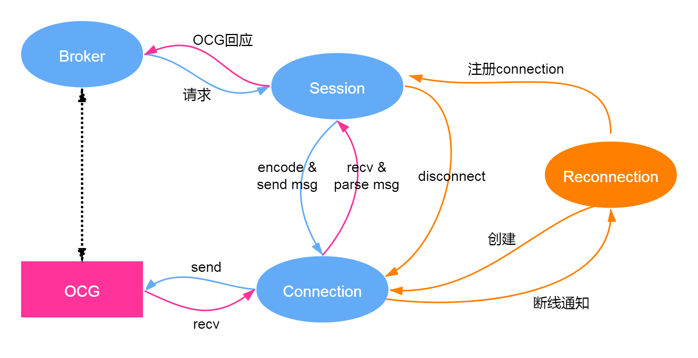

# OCG/BSS
## 1. BSS简介
### 1.1. 背景
OCG：港交所领航星证券交易平台(OPT-C)的前置交易网关  
BSS: 经纪自设系统，即与OCG对接的客户端，相当于交易柜台  
如果想要直接接入到港交所OCG，需要完成BSS三个阶段的开发及测试
1. 第一阶段：离线测试，主要是验证消息格式的正确性
2. 第二阶段：端对端测试，连接到测试环境进行测试，这个阶段需要完成一个各项功能完备的BSS开发
3. 第三阶段：推出前测试，连接到OCG进行模拟测试
完成三个测试通过认证后，才可使用该BSS直接到港交所进行交易

### 1.2. BSS开发目的
根据OCG文档，开发一个符合以下要求的交易柜台：
1. 可正常进行交易：能下单、撤单、改单等
2. 消息管理：消息序列号管理、消息重传等
3. 能从各种异常情况中恢复：网络异常、数据异常

## 2. BSS架构
根据功能，把BSS划分为4个模块：
* 业务模块：该模块收到的数据都是连续的、正确的，只需要专注于业务逻辑的处理即可
* 会话模块：对消息进行管理，保证业务模块消息的正确性
* 连接模块：
  * 接收从会话模块发来的消息并编码到发送缓存区中发送
  * 从OCG收取数据并在解码之后转发给会话模块处理
* 连接管理模块：
  * 通过Lookup Service查找OCG的地址，创建到OCG的连接并注册到会话模块中
  * 在异常出现时会自动进行重连

BSS的架构如图2.1所示

图2.1 BSS架构

BSS各个模块的关系如图2.2所示

图2.2 BSS模块间的关系

## 3. 模块设计

### 3.1. 业务层 Broker
业务层关注以下消息，除了Logon, Logout, Reject属于Admin类型消息外，其他都是业务类型消息
* Logon
* Logout
* Reject
* Execution report
  * Order Accepted
  * Order Rejected
  * Order Cancelled
  * Order Cancelled -- Unsolicited
  * Order Cancelled -- On Behalf Of
  * Order Expired
  * Order Amended
  * Order Cancel Rejected
  * Order Amend Rejected
  * Trade (Board lot Order Executed)
  * Auto-matched Trade Cancelled
  * Trade (Odd lot/Special lot Order Executed)
  * Trade (Semi-auto-matched) cancelled
* Order Mass Cancel Report
* Trade Capture Report
* Trade Capture Report Ack
* Business Message Reject

### 3.2. 会话层 Session
Session用于消息管理及心跳检测
#### 3.2.1. 消息管理
消息头字段的检查只是检查Comp ID是否是该BSS的Comp ID。
而序列号的检查则较为复杂，BSS发出的消息和OCG发出的消息都会带有一个SeqNum字段，该字段会在每个交易日开始时重置为1，随后每发出一条消息就递增1。
BSS和OCG都会维护下面两个序列号：
* NextExpectedSeqNum：下一条待收消息的序列号
* NextSendSeqNum：下一条待发消息的序列号
NextSendSeqNum在每一条消息中都存在，而NextExpectedSeqNum只会在登录消息中互相告知对方

如果收到的消息的序列号不是预期的，BSS应该采取相应的处理措施（断开连接或是请求重传）
对于从OCG发来的消息，处理流程如下

对于OCG的数据恢复只存在于登录过程中，如果BSS收到OCG的登录回报后，发现OCG的NextExpectedSeqNum小于BSS的NextSendSeqNum，则BSS需向OCG重传缺失的数据

#### 3.2.2. 心跳检测
* BSS在20秒未发出任何消息的情况下，应该主动发送一条心跳消息（OCG同理）
* BSS在60秒内未收到OCG的任何完整消息时，应主动发出一条Test Request请求，要求OCG回一个心跳包（OCG同理）
* BSS在发出Test Request 60秒后未收到OCG回应的心跳包，则应该主动断开连接（OCG同理）

### 3.3. 连接层 Connection
* Connection会把Session发来的数据编码到发送缓冲区中，并不断地调用send发送出去
* Connection会不断地从OCG收取数据并进行解码，解码后的消息会交由Session处理

### 3.4. 连接管理层 Reconnection
Session主动断开连接或是OCG主动断开连接，Reconnection模块都会收到通知，并根据OCG规定的重连时间间隔进行重连
